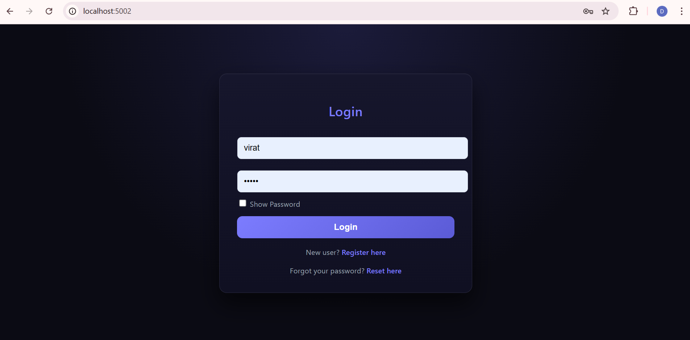
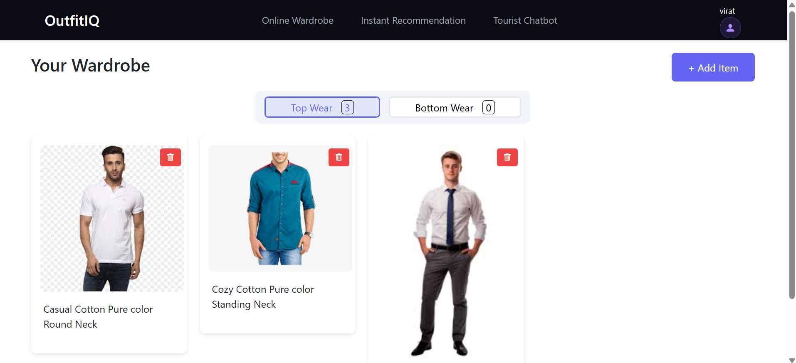
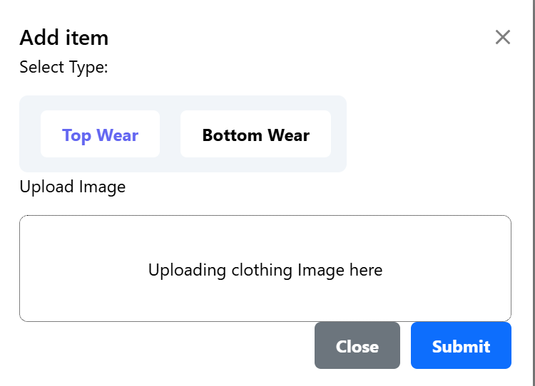
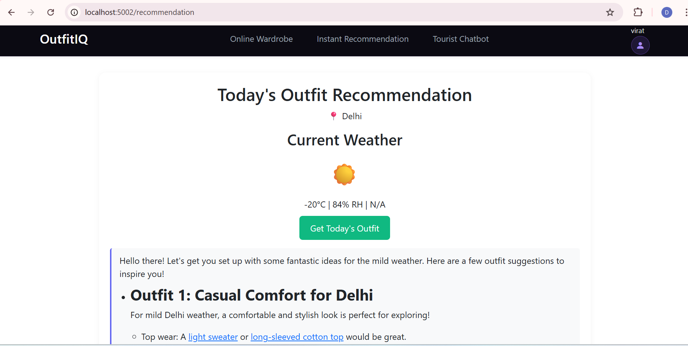
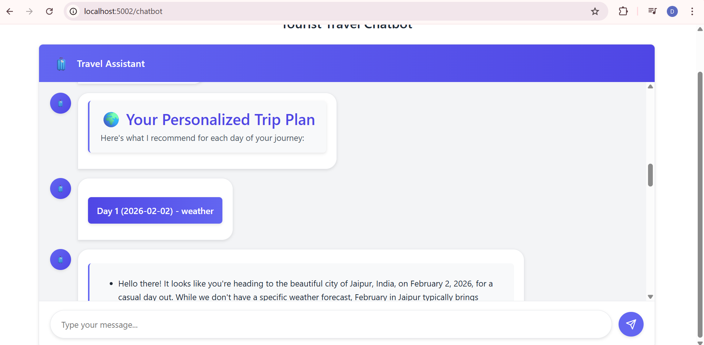

# OutfitIQ  
### AI-Driven, Weather-Aware Outfit & Travel Recommendation Platform

---

## 🚀 Overview

**OutfitIQ** is an intelligent wardrobe assistant that helps users make better outfit decisions using **AI, weather intelligence, and personal context**. Instead of suggesting generic clothing ideas, OutfitIQ works directly with a user’s **own wardrobe**, analyzing uploaded clothing images and recommending what to wear based on **current weather, travel plans, and occasion type**.

The system combines **computer vision**, **rule-based reasoning**, and **weather-driven clustering** to generate practical, explainable outfit recommendations. From daily outfit selection to multi-day travel packing, OutfitIQ acts as a personal digital stylist focused on comfort, suitability, and style.

---

## 🧭 Problem Statement

Most fashion recommendation systems:
- Ignore what users actually own  
- Rely on opaque, black-box models  
- Do not adapt to weather or travel scenarios  

**OutfitIQ solves this by:**
- Operating on a **user’s real wardrobe**
- Using **transparent, explainable logic**
- Adapting recommendations to **weather + occasion context**

---

## ✨ Key Features

### 🔐 Secure User Accounts
- Session-based authentication  
- User-specific wardrobe isolation  
- Personalized recommendations  

---

### 🧠 Clothing Attribute Extraction (Computer Vision)
- CNN-based models analyze uploaded clothing images  
- Extracted attributes include:
  - Sleeve length  
  - Lower garment length  
  - Neckline type  
  - Fabric-related characteristics  

These attributes drive downstream scoring and recommendations.

---

### 📊 Explainable Outfit Scoring
Each clothing item is evaluated using a **rule-based scoring system** inspired by textile comfort research (e.g., **ISO 11092**):

- **Thermal suitability (warmth)**
- **Breathability**
- **Occasion compatibility**

This ensures decisions are **transparent and interpretable**, unlike black-box recommenders.

---

### 🌦️ Weather-Aware Recommendations
- Uses real-time weather data  
- Weather conditions are clustered using a **K-Prototypes model**  
- Matches clothing items to conditions such as:
  - Sunny  
  - Rainy  
  - Cloudy  
  - Cold  

---

### 👕 Virtual Wardrobe
- Upload and manage:
  - Top wear  
  - Bottom wear  
- Clothing items persist across sessions and recommendations  

---

### ⚡ Instant Outfit Suggestions
- One-click recommendations based on **live weather**
- Uses only clothing available in the user’s wardrobe  

---

### ✈️ AI-Powered Travel Packing Assistant
- Chatbot-style interface  
- Generates packing lists based on:
  - Destination weather  
  - Trip duration  
  - Occasion types (casual, formal, party, etc.)

---

## 📦 Dataset & Assumptions

### Dataset
- Built using the **DeepFashion-MultiModal dataset**
- Images were cleaned and separated into:
  - Top wear  
  - Bottom wear  
- Accessories and irrelevant items were removed

### Assumptions
- Users upload clean, front-facing clothing images  
- Comfort scores are derived from standardized thermal literature  

---


**Flow Summary:**
1. User uploads clothing images  
2. Attribute extraction via vision models  
3. Rule-based scoring + weather clustering  
4. Outfit or packing recommendations  
5. Results shown via web UI or chatbot  

---

## 🛠️ Installation

```bash
# Clone the repository
git clone https://github.com/<your-username>/OutfitIQ.git
cd OutfitIQ

# Create virtual environment
python -m venv venv
source venv/bin/activate   # Windows: venv\Scripts\activate

# Install dependencies
pip install -r requirements.txt

# Run the application
python app.py
```

## 🧪 Usage
- Sign up or log in
- Upload top and bottom wear images
- Verify extracted attributes

- Choose: Instant outfit recommendation
- Travel planning chatbot
- Receive personalized suggestions

## 🖼️ Screenshots
### Login/Register
<p align="center">  </p>

### Virtual Wardrobe
<p align="center">  </p>

### Add to Wardrobe
<p align="center">  </p>

### Weather-Based Recommendations
<p align="center">  </p>

### Travel Planning Chatbot
<p align="center">  </p>

## 🚀 Deployment
- Local deployment using Flask

## Future deployment options:
- Render
- Hugging Face Spaces
- Streamlit

## 🔮 Future Enhancements
- Virtual Try-On Integration
- Visualize recommended outfits on avatars using models like StableVITON

## Adaptive Personalization
- Learn from user feedback (likes, skips, ratings)
- Color Psychology & Trend Awareness
- Recommend outfits based on mood, event tone, and fashion trends
- Voice & Multilingual Support
- Improve accessibility through voice commands and multiple languages
- Extended Weather Forecasting
- Support long-term travel planning with premium weather APIs

## ⚠️ Limitations
- Weather forecasts limited to short-term ranges
- Static image uploads only (no live try-on yet)
- Rule-based scoring is not user-adaptive
- No shared or collaborative wardrobes


## ⭐ Final Note

OutfitIQ demonstrates how explainable AI, computer vision, and weather intelligence can be combined to solve real-world wardrobe decision problems focusing on practicality, transparency, and user-centric design.
